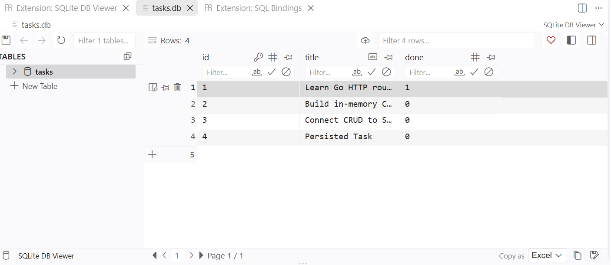
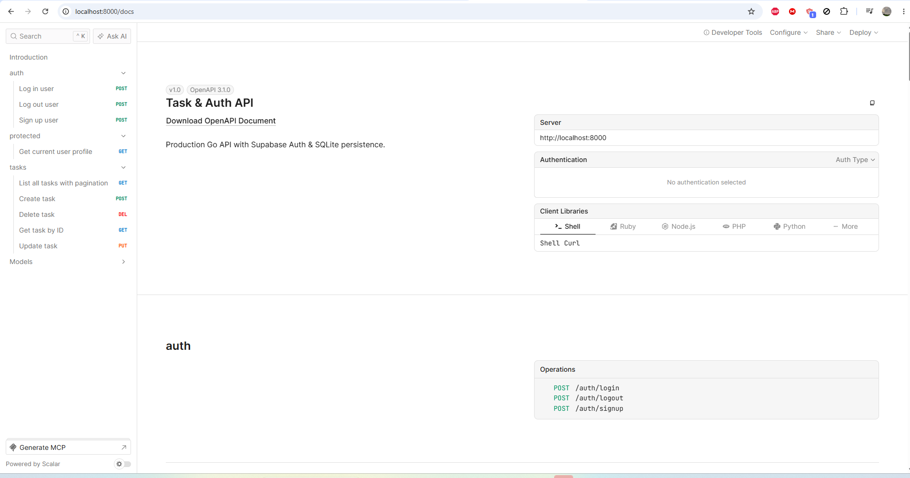

# Task API

Task API is a Go REST API for managing tasks and authenticating users with Supabase. It uses Go's standard `net/http` server, SQLite for task persistence, structured JSON logging, and vertical feature modules for route registration and resource lifecycle management.

## Setup

### Prerequisites

- Go 1.26.6 or later
- A Supabase project with its project URL and publishable key

Create a `.env` file in the repository root. The server loads it automatically at startup:

```dotenv
SUPABASE_URL=https://your-project.supabase.co
SUPABASE_PUBLISHABLE_KEY=your-publishable-key
DB_PATH=tasks.db
PORT=8000
```

`SUPABASE_URL` and `SUPABASE_PUBLISHABLE_KEY` are used by Supabase authentication and token validation. `DB_PATH` and `PORT` are optional; they default to `tasks.db` and `8000`.

### Run

From the repository root, run:

```bash
go run ./cmd/server
```

The API listens on `http://localhost:8000` unless `PORT` is changed.

## Why SQLite?

SQLite was chosen because the API needs durable task storage without requiring a separate database server. It keeps the project easy to run locally, stores the entire database in a portable `tasks.db` file, and still provides SQL queries, constraints, and reliable persistence for this small CRUD service.

## Stage 4: Verify SQLite Data

The Stage 4 database check used this query in SQLite DB Browser:

```sql
SELECT id, title, done
FROM tasks
ORDER BY id ASC;
```

### DB Browser Screenshot



## API Reference

These five endpoints cover the main health, authentication, profile, and task-list flows. Authenticated requests must send `Authorization: Bearer <supabase-access-token>`.

| Method | Endpoint | Description | Auth required |
| --- | --- | --- | --- |
| `GET` | `/health` | Check whether the API is running | No |
| `POST` | `/auth/signup` | Create a Supabase user account | No |
| `POST` | `/auth/login` | Sign in and receive access and refresh tokens | No |
| `GET` | `/protected/profile` | Get the current authenticated user's profile | Yes |
| `GET` | `/tasks` | List stored tasks with pagination | No |

The API also exposes task CRUD operations at `GET /tasks/{id}`, `POST /tasks`, `PUT /tasks/{id}`, and `DELETE /tasks/{id}`, plus `POST /auth/logout`, `GET /`, `GET /public/info`, and the interactive documentation at `/docs`.

## Sample Request

Create a task with PowerShell:

```powershell
$body = @{ title = "Finish backend assignment" } | ConvertTo-Json
Invoke-RestMethod -Uri "http://localhost:8000/tasks" -Method Post -Body $body -ContentType "application/json"
```

Example response:

```json
{
  "id": 4,
  "title": "Finish backend assignment",
  "done": false
}
```

Update a task:

```powershell
$updateBody = @{ title = "Finish assignment week 2"; done = $true } | ConvertTo-Json
Invoke-RestMethod -Uri "http://localhost:8000/tasks/4" -Method Put -Body $updateBody -ContentType "application/json"
```

## API Documentation

With the server running, open [Scalar API documentation](http://localhost:8000/docs) for an interactive reference and request tester. The source OpenAPI 3.0 specification is available in [swagger.json](docs/swagger.json).

### Scalar UI Screenshot

<!-- Replace the path below with the captured screenshot stored in the repository. -->


## Scraper Target Classification (Stage 0)

- **Target site:** [Books to Scrape](https://books.toscrape.com/)
- **Purpose and permission:** The site's homepage explicitly describes it as an open practice sandbox built for testing and learning web scraping.
- **Robots.txt check:** [`robots.txt`](https://books.toscrape.com/robots.txt) returned HTTP 404, indicating that no robots file was found. Permission is established by the site's sandbox designation.
- **Scope:** Exactly the first three catalogue pages, covering approximately 60 book detail pages.
- **Data collected:** Book title, product URL, price text, availability, rating, description, source page, and fetch timestamp.
- **Ethics commitment:** I will not reuse this code on another site without checking that site's rules and terms first.

## License

MIT